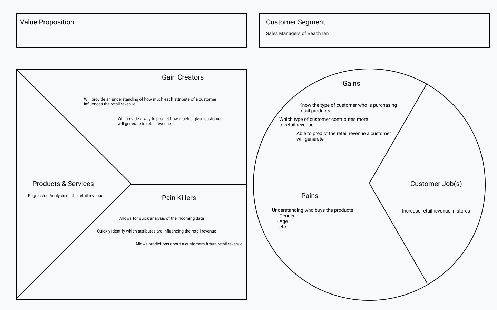

```{r setup, include=FALSE}
knitr::opts_chunk$set(echo = TRUE,
                      cache=TRUE,
                      out.width="100%",
                      warning=FALSE,
                      message=FALSE,
                      clean_cache=TRUE)
```

# Overview

Beach Tan Inc. is one of the nation's largest franchisers of tanning salons. The data set I received from the client contains data for 10 locations in 2014. From the data provided, I decided to model the retail revenue a customer generates when purchasing various skin care lotions and products that Beach Tan offers in their stores. Using linear regression I was able to create a model allowing the interpretation of what factors can increase retail revenue for Beach Tan. This was done to align with the business value proposition canvas I created for the client, shown below.



The code block below documents the list of R packages that I used in this project. For convenience, I used the package manager *Pacman* since it allows the installation and loading of all necessary packages in one step.

```{r}
if(require(pacman)==FALSE)
  install.packages("pacman")
pacman::p_load(dplyr, corrplot, skimr)
```

# Data Description

The data set has the following data dictionary:

* UIDClient - Client Identification Number
* UIDStoreLocation - Store Identification Code.  Only ten of the stores are included for the analysis.
* Gender - 0 = Female, 1 = Male
* DateJoined - Date the client joined. If client is a non-member, this is the date and time of their first tanning session.
* DaysSinceJoined - The number of days elapsed between DateJoined and 11/1/2014.
* MembershipType - 0 = Non Membership, 1 = Monthly Membership, 2 = Annual Membership.
* MembershipLevel - A membership at BT typically includes unlimited tanning service for a particular level (Fast, Faster, Fastest, and Instant). The levels are based on the level of tanning equipment. The higher the membership level is, the higher the tanning equipment available to the client, and the faster tanning results received. “Fast” is the basic level, and “Instant” is the highest level.0 = Non Membership, 1 = Fast, 2 = Faster, 3 = Fastest, 4 = Instant.
* Age	- Age of client in years
* UVTans - The number of Ultra Violet Tans a client has taken since he/she joined BT.
* SunlessTans	- The number of Sunless Tans a client has taken since he/she joined BT.
* UpgradeRevenue - Amount spent (in dollars) by members to tan in a higher level bed than what their regular membership would include.
* RetailRevenue	- Amount spent (in dollars) on various skin care lotions and products that BT offers.

Since we will be performing linear regression the data set must contain only numerics and factors. Thus, after reading in the data some columns will need to be converted to factors.

```{r}
tan = read.csv("Data/BeachTan.csv", stringsAsFactors=TRUE)
tan$UIDClient = as.factor(tan$UIDClient)
tan$UIDStoreLocation = as.factor(tan$UIDStoreLocation)
tan$DateJoined = as.factor(tan$DateJoined)
tan$Gender = as.factor(tan$Gender)
tan$MembershipType = as.factor(tan$MembershipType)
tan$MembershipLevel = as.factor(tan$MembershipLevel)
```

Before pressing on with any analysis it is best to check our data to ensure everything is now of the correct type and to check if we have any interesting data points. We can do so using the *skim* function from the *skimr* package.

```{r}
skim(tan)
```

From the readout above, we observe that we have no missing values, however, the gender has two extra levels that will need to be remedied in the next section. The remainder of the columns all have values that make sense and the numerics are right-skewed which is to be expected.

Before moving on to preprocessing the data it is important to check the data for any correlation that may exist between variables. The output below shows that none of our variables are highly correlated so we can move on with confidence.

```{r}
nums = unlist(lapply(tan, is.numeric))
tan.num = tan[,nums]
M = cor(tan.num, use = "complete.obs")
corrplot(M, type="upper", method='circle')
```


# Preprocessing

As noted in the previous section the gender column contains additional levels other than 0 = Female and 1 = Male.

```{r}
count(tan, Gender)
```

In order to retain the information in the 20 rows that contain values for Gender outside of our data dictionary we will group them into a level called "Missing". This will allow us to continue to use Gender for analysis.

```{r}
tan$Gender = recode_factor(tan$Gender, "0"="0", "1"="1", .default="Missing")
levels(tan$Gender)
```

There are two columns that we can remove in order to build a better model, the client identification number (*UIDClient*) and the date the client joined (*DateJoined*). The client ID is good to remove as every client's ID is unique to them and contains many levels. The date the client joined should be removed as it contains many levels and we have a column for how many days have passed since the client joined which is numeric so only takes one degree of freedom.

```{r}
tan = select(tan, -UIDClient, -DateJoined)
colnames(tan)
```

The UpgradeRevenue column can be converted to a factor representing if a member has upgraded or not, which is a better business metric.

```{r}
tan$hasUpgraded = with(tan, ifelse(UpgradeRevenue == 0, as.character(0), as.character(1)))
tan$hasUpgraded = as.factor(tan$hasUpgraded)
tan = select(tan, -UpgradeRevenue)
colnames(tan)
```

Finally, the data set must be split into training and validation sets for model building and testing. We must also set a random seed so we can reproduce the analysis.

```{r}
set.seed(1337)
sample_size = floor(nrow(tan)*0.7)
index = sample(1:nrow(tan), size=sample_size)
tan.train = tan[index,]
tan.valid = tan[-index,]
```

# Conclusion

In order to find the best possible model for the client I used best subsets and stepwise regression techniques. I chose only to consider first order linear regression models with no interaction terms. After performing best subsets and stepwise regression I was left with four models as candidates for the final model for the client. In the business value proposition canvas, I promised the client the ability to know what attributes of a customer effect the retail revenue generated by said customer, and the ability to predict the retail revenue of future customers (or a current customer with future values) I will analyze both the model adequacy and the model validity for each model. I have provided a supplemental file `models.R` which contains the necessary code for creating the following four models:

* Model 1 - The full first-order linear regression without any interaction terms: UIDStoreLocation, Gender, DaysSinceJoined, MembershipType, MembershipLevel, Age, UVTans, SunlessTans, and hasUpgraded.
* Model 2 - The following variables were used: UIDStoreLocation, Gender, MembershipType, MembershipLevel, UVTans, SunlessTans, and hasUpgraded.
* Model 3 - The following variables were used: Gender, MembershipType, MembershipLevel, UVTans, SunlessTans, and hasUpgraded.
* Model 4 - Rows with Gender missing were removed from the data set and then the following variables were used: Gender, MembershipType, MembershipLevel, UVTans, SunlessTans, and hasUpgraded.

The following table is a summary of each model's adequacy and validity. Model 1, although the best in terms of model adequacy has a lot of insignificant predictors in the model, however Model 4's performance is close to Model 1 but with many insignificant variables removed. Since Model 4 is both simpler and performs just as well as Model 1 in terms of model adequacy it is the model I will use for interpreting the effects of each customer attribute on retail revenue. Interestingly, when analyzing model validity it should be noted that all four models performed better on the validation data than the training data, this will require further analysis to find out why. Model 4 performs the best in terms of model validity as it has the highest $R^2_{validation}$ and lowest ASE. However, with such a low $R^2$ values it will not be possible to use these models for prediction of a customer's retail revenue. In best subsets, when finding the model with the best BIC Model 4 (minus some levels of factors) was the model selected.

| Metric  | Model 1 | Model 2 | Model 3 | Model 4 |
|:-       |:-       |:-       |:-       |:-       |
| **$R^2$**   | 0.3428  | 0.3426  | 0.3406  | 0.3397  |
| **$R^2_a$** | 0.341   | 0.3409  | 0.3397  | 0.3388  |
| **Model Significance**     | Model is significant at any reasonable level       | Model is significant at any reasonable level       | Model is significant at any reasonable level       | Model is significant at any reasonable level |
| **Insignificant Coefficients**   | Age, MembershipLevel1, MembershipType1, DaysSinceJoined, GenderMissing, and all but one of UIDStoreLocation are not significant at the 5% level     | MembershipLevel1, MembershipType1, GenderMissing, and all but one of UIDStoreLocation are not significant at the 5% level       | MembershipLevel1, MembershipType1, and GenderMissing are not significant at the 5% level       | MembershipLevel1, and MembershipType1 are not significant at the 5% level |
| **$R^2_{validation}$** | 0.3564185 | 0.3564842 | 0.3558100 | 0.3575036 |
| **ASE** | 5800.956 | 5800.364 | 5806.441 | 5772.099 |

It is important to note before moving on that the selected model for the best performance and simplicity of the model does omit several variables that one might believe to be important such as: Store location, the number of days the customer has been a member (or since their first tan), and the customer's age. Most interestingly out of these is the customer's age and the days since the customer joined.

Below is the code for generating our selected model, Model 4. Included is a summary of the model which we will use to interpret the coefficients below.

```{r}
tan.train.no.missing.gender = tan.train[!(tan.train$Gender=="Missing"),]
tan.model.4 = lm(RetailRevenue~.-Age-DaysSinceJoined-UIDStoreLocation, data=tan.train.no.missing.gender)
summary(tan.model.4)
```

We can only interpret statistically significant variables in the model and so below is a list of the interpreted coefficients:

- **Gender1** - Male customers are estimated to produce $15.69 less retail revenue than female customers when comparing customers of the same membership type, membership level, number of UV tans, number of sunless tans, and whether they have upgraded or not.
- **MembershipType2** - Annual members are estimated to produce $40.22 more retail revenue than non-members when comparing customers of the same gender, membership level, number of UV tans, number of sunless tans, and whether they have upgraded or not.
- **MembershipLevel2** - Customers in the *Faster* membership level are estimated to produce $29.57 more retail revenue than non-members when comparing customers of the same gender, membership type, number of UV tans, number of sunless tans, and whether they have upgraded or not.
- **MembershipLevel3** - Customers in the *Fastest* membership level are estimated to produce $64.68 more retail revenue than non-members when comparing customers of the same gender, membership type, number of UV tans, number of sunless tans, and whether they have upgraded or not.
- **MembershipLevel4** - Customers in the *Instant* membership level are estimated to produce $69.63 more retail revenue than non-members when comparing customers of the same gender, membership type, number of UV tans, number of sunless tans, and whether they have upgraded or not.
- **UVTans** - For each additional UV tan a customer has we estimate an increase in retail revenue of $1.18 when comparing customers of the same gender, membership type, membership level, number of sunless tans, and whether they have upgraded or not.
- **SunlessTans** - For each additional sunless tan a customer has we expect an increase in retail revenue of $0.89 when comparing customers of the same gender, membership type, membership level, number of UV tans, and whether they have upgraded or not.
- **hasUpgraded1** - Customers who have paid to tan in a higher level bed than what their regular membership would include are estimated to produce $12.20 more retail revenue than customer who have never upgraded when comparing customers of the same gender, membership type, membership level, number of UV tans, and number of sunless tans.

From the above coefficient interpretation we immediately see some variables have a much higher impact on retail revenue. The best way to increase retail revenue is encouraging customers to become *Instant* level members and to encourage customers to pay to tan in a higher level bed than what their membership includes. Another interesting finding from this analysis is that if a customer uses a UV tanning solution instead of a sunless tanning solution we would estimate an extra $0.29 in retail revenue from that customer. Rather unsurprisingly males generate far less retail revenue than females, however, without knowing the items the stores are selling this could be due to a lack of selection for male customers. Perhaps an analysis with equal numbers for males and females would garner a different conclusion.

There are several recommendations I will make for future analysis in order to create a better solution for the client:

1. Try some models with interactions as one would hypothesize that there are some interactions between the membership level and whether or not the customer will upgrade and some interactions between age and the type of tanning solution a customer chooses.
1. Apply a transform on the data to lessen the effect of the data being right-skewed.
1. Have an analyst visit the stores and ask the staff what factors they believe contribute to whether or not a customer will buy some retail items. This could lead to further recommendations on what data to collect and include in the model.
1. If the client wasn't interested so much in how much a customer would spend on retail items but rather if a customer would buy anything at all then a classification algorithm may prove useful.
