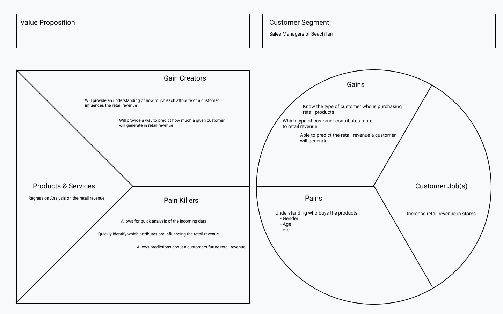

```{r setup, include=FALSE}
knitr::opts_chunk$set(echo = TRUE,
                      cache=TRUE,
                      out.width="100%",
                      warning=FALSE,
                      message=FALSE,
                      clean_cache=TRUE)
```

# Overview
> Overview of the analysis and necessary references

What are my goals for the analysis? Show the business value proposition canvas for convenience of readers.



The code block below documents the list of R packages that I used in this project. For convenience, I used the package manager *Pacman* since it allows the installation and loading of all necessary packages in one step.

```{r}
if(require(pacman)==FALSE)
  install.packages("pacman")
pacman::p_load(dplyr, DataExplorer, corrplot, leaps, skimr)
```

# Data Description
> Complete description of the data

```{r}
tan99 = read.csv("Data/BeachTan.csv")
skim(tan99)
```

What information was included in the data

# Preprocessing
> Details on data preprocessing are provided

# Conclusion
> A meaningful discussion of conclusions is included. The conclusion addresses the Business Value Proposition Canvas, and discusses how the solution meets the requirements of the customer segment.
